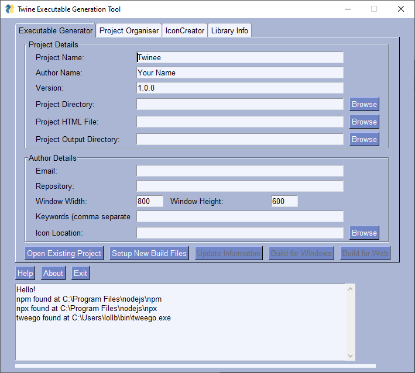

# TwEGeT
**Tw**ine **E**xecutable **Ge**nerator **T**ool  
(although it really works with any HTML based project)

Want to distribute your Twine stories as applications?  
Don't want the hassle dealing with command lines?  
Want to easily update the application?  
Want to make sure your app has icons?  
TwEGeT (may) be for you!

## Using TwEGeT
1. Name your story
2. Locate your story source files (where your images and audio exist)
3. Locate your story's main HTML file (usually in the Twine2 library)
4. Select where you want all the magic to happen 
5. Press "Setup"
6. Press "Build for X"
7. Done

## Who is TwEGeT (for)?
- People who aren't familiar or overly confident with turning Twine stories into executables
- People who are primarily authors and have little-to-no idea how to deal with the CLI
- People who are sick of having to get other people to generate executables because they have system X
- People who are a bit tired of dealing with all the idiosyncrasies of the different tools used (that's me!)

## Why is TwEGeT?
Deploying Twine stories is usually dead simple (heck, they're HTML files).  
However, some stories are media rich and become a little more confusing to package.  
And of course, with lots of media, comes large file-sizes. But that is only 1 problem.
As time continues its course, web technologies change and occasionally certain things become obsolete, either by way of design or by accident.

Hosting a Twine story to access in a browser is a wonderful thing, but sometimes these technology changes make stories impossible to play in their original state.
As such, deploying a story in a static browser, prevents[^1] this from happening. 

Therefore, TwEGeT aims to solve 2 problems.

## What is TwEGeT?

It is a tool to simply generate distributable standalone executable files for uploading to wherever you see fit, e.g. itch.io, GameJolt, Steam

## How is TwEGeT?

TwEGeT is, in reality, a front-end, built in Python, to control some slightly annoying functionality when wanting to distribute Twine stories as standalone applications. 
Moreover, it is platform agnostic, which means you can build executables for the three main classes of systems. 

**Python 3.6**
 - All standard libraries, except for:
   - PySimpleGUI (for the GUI)
   - Pillow (for the icon creation tool)
 
**NPM & NPX**
 - Electron Forge
 
 **TweeGo**

## Future
- Generate build scripts for CLI usage
- Build executables for Steam
- Build executables for mobile (I.e. PhoneGap)
- Automated media importing and full directory creation
- Inevitable design changes

## Additional information
Posts on the design and purpose of TwEGeT:
1. (https://lockeb.dev/2020/02/16/yate-i-guess.html)

---
[^1]: It is possible that these will be made obsolete as well but this seems like a good solution right now.

